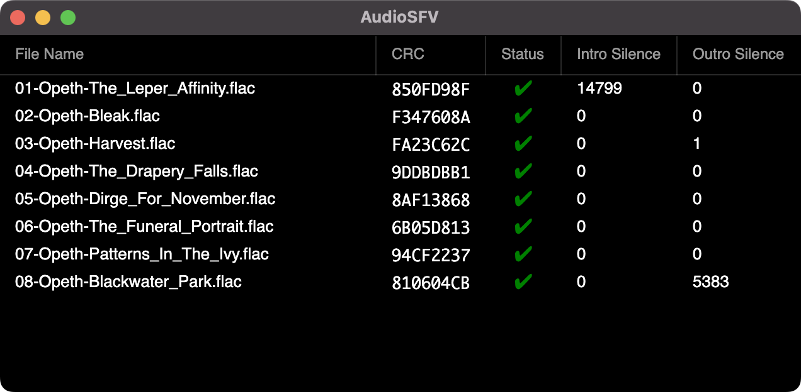

# AudioSFV

AudioSFV introduces a file format, “.sfva” (Simple File Verification for Audio), that stores a CRC32 of the unencoded audio payload only. An audio track has the same checksum regardless of container (e.g. WAV vs lossless compression such as FLAC), and independent of tags/metadata.

## Features
- Windows/macOS support
- Fast multi-threaded processing
- Detects number of intro/outro silence samples (useful for gauging whether CD offset correction lost samples for drives that can't overread)

## Limitations
- Only supported audio format is FLAC
- Only reads/verifies but does not create .sfva files

## Screenshot


## The .sfva file format
Inspired by .sfv, each line contains:
- Filename, one or more spaces, then 8 hex digits (CRC32)
- The filename may contain spaces; the CRC is the last space-separated token
- Comments start with ';' on a line by themselves

Example:
```
; Demo album
01 - Intro.flac 1A2B3C4D
02 - Main Theme.flac ABCDEF01
```

## How to use it
- Right-click a .sfva file → Open With → choose AudioSFV
- Command line: pass a single .sfva path as the first argument

To create a .sfva when ripping a CD, it's recommended to take the CRCs out of EAC's log. Even better if you Test & Copy to ensure accuracy. The .sfva can be then used to make sure nothing went wrong prior to or during encoding.
